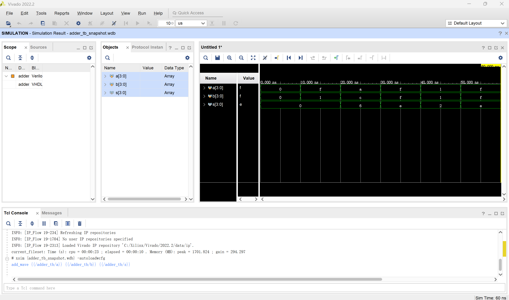

# easyFPGA
## Makefile管理Xilinx-FPGA项目开发 (part-2)
**branch name:** __demo_makefile_project__
这个branch演示了:
1. Makefile管理Vivado Simulator
2. Makefile管理Vivado Project，包括synth/impl/program/ip_gen等  

**一个简单的例子**  
加法器adder包括了设计文件adder.vhd,仿真文件adder_tb.v和makefile，目录如下：
- libaray
	- adder
		- src
			- adder.vhd
			- adder_tb.v
		- makefile  

makefile的内容如下，用户只需要修改源文件和指定顶层文件，便能在其他项目复用。
```makefile
# synth top module name
FPGA_TOP = adder

# simulation top module name
FPGA_SIM_TOP = adder_tb

# Files for synthesis
SYN_FILES += $(wildcard src/*.v)
SYN_FILES += $(wildcard src/*.vhd)

include ../../scripts/vivado.mk
```

**支持的命令**
```bash
make simulate
make waves #check waves in vivado
make complile
make elaborate
make ip_gen
make clean
```

make waves命令的结果输出如下：
``` bash
$ make waves
### NO SYSTEMVERILOG SOURCES GIVEN ###
### SKIPPED SYSTEMVERILOG COMPILATION ###

### COMPILING VERILOG ###
INFO: [VRFC 10-2263] Analyzing Verilog file "C:/repo2/easyFPGA/library/adder/src/adder_tb.v" into library work
INFO: [VRFC 10-311] analyzing module adder_tb

### COMPILING VHDL ###
INFO: [VRFC 10-163] Analyzing VHDL file "C:/repo2/easyFPGA/library/adder/src/adder.vhd" into library work
INFO: [VRFC 10-3107] analyzing entity 'adder'

### ELABORATING ###
Vivado Simulator v2022.2
Copyright 1986-1999, 2001-2022 Xilinx, Inc. All Rights Reserved.
Running: C:/Xilinx/Vivado/2022.2/bin/unwrapped/win64.o/xelab.exe -debug all -top adder_tb -snapshot adder_tb_snapshot
Multi-threading is on. Using 14 slave threads.
Starting static elaboration
Pass Through NonSizing Optimizer
Completed static elaboration
Starting simulation data flow analysis
Completed simulation data flow analysis
Time Resolution for simulation is 1ps
Compiling package std.standard
Compiling package std.textio
Compiling package ieee.std_logic_1164
Compiling package ieee.numeric_std
Compiling architecture behavioral of entity work.adder [adder_default]
Compiling module work.adder_tb
Built simulation snapshot adder_tb_snapshot

### RUNNING SIMULATION ###

****** xsim v2022.2 (64-bit)
  **** SW Build 3671981 on Fri Oct 14 05:00:03 MDT 2022
  **** IP Build 3669848 on Fri Oct 14 08:30:02 MDT 2022
    ** Copyright 1986-2022 Xilinx, Inc. All Rights Reserved.

source xsim.dir/adder_tb_snapshot/xsim_script.tcl
# xsim {adder_tb_snapshot} -autoloadwcfg -tclbatch {../../scripts/xsim_cfg.tcl}
Time resolution is 1 ps
source ../../scripts/xsim_cfg.tcl
## log_wave -recursive *
## run all
Test Case 1: Adding zeros
Test Case 2: Adding with carry
Test Case 3: Adding different values
Test Case 4: Adding maximum values
Test Case 5: Single bit addition
Test Case 6: All bits set
Test finished!
## exit
INFO: [Common 17-206] Exiting xsim at Sat Mar  1 12:37:31 2025...

### OPENING WAVES ###

****** xsim v2022.2 (64-bit)
  **** SW Build 3671981 on Fri Oct 14 05:00:03 MDT 2022
  **** IP Build 3669848 on Fri Oct 14 08:30:02 MDT 2022
    ** Copyright 1986-2022 Xilinx, Inc. All Rights Reserved.

start_gui

```
  

**另一个简单的例子**  
demo_zc706包括了可综合文件switch2leds.v,约束文件zc706_system_constr.xdc和makefile，目录如下：
- demo_zc706
	- src
		- switch2leds.v
	- constraints
		- zc706_system_constr.xdc
	- makefile  

makefile的内容如下，用户只需要重新指定源文件和约束文件等，便能在其他项目复用。
```makefile
BUILD_DIR = build

# FPGA settings
PROJECT = demo_zc706
FPGA_PART = xc7z045ffg900-1
FPGA_TOP = switch2leds

# Files for synthesis
SYN_FILES += $(wildcard src/*.v)

# Constraints
XDC_FILES += constraints/zc706_system_constr.xdc

include ../../scripts/vivado.mk
```

**支持的命令**
```bash
make all # build project and generate bit file
make waves #simulate and check waves in vivado
make synth
make impl
make program
make ip_gen
make clean
```