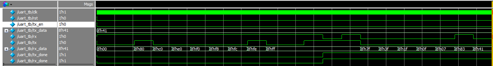

# UART
basic是AI根据提示词的设计输出，之所以是简单版本，因为设计要求过于复杂，AI的设计输出就会有各种问题。在接下来的对话中不断优化提示词，有些问题会得到解决，但有些需要手动修改，优化后的版本为advanced。

## basic
1. 提示词
- design a verilog module for uart interface, don't need to consider fifo
- how about test bench of this simplified module for UART?
- #file:uart.v #file:uart_tb.v , write modelsim commands for simulation, and uart_tb is top module
2. 输出文件
- uart.v
- uart_tb.v
- run_sim.do
3. 仿真结果

## advanced
